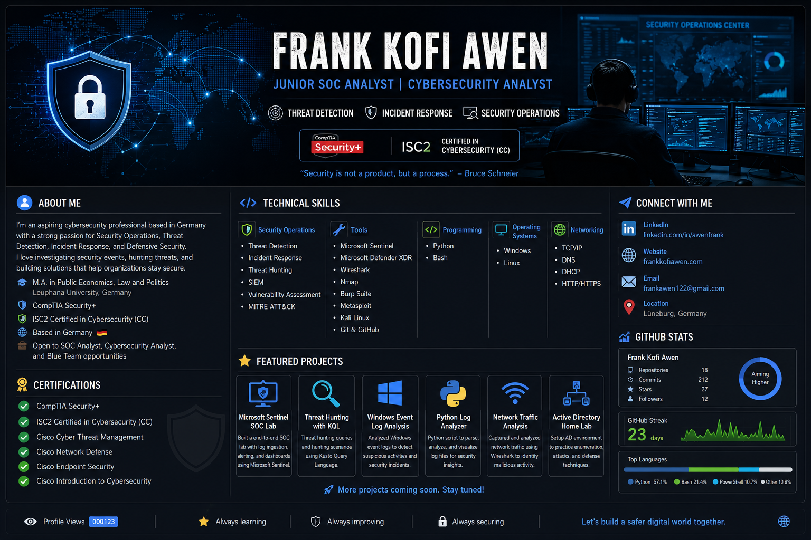

# 👋 Hi, I'm Frank Kofi Awen

### 🛡️ Junior SOC Analyst | Cybersecurity Analyst | Threat Detection | Incident Response

I'm an aspiring cybersecurity professional based in Germany with a passion for defending systems, investigating security events, and continuously improving my skills through hands-on labs and real-world projects.

---

## 👨‍💻 About Me

- 🛡️ Junior Cybersecurity Professional
- 🎓 M.A. in Public Economics, Law and Politics – Leuphana University, Germany
- 📍 Based in Germany
- 🏆 CompTIA Security+
- 🏆 ISC2 Certified in Cybersecurity (CC)
- 💼 Open to SOC Analyst, Cybersecurity Analyst, and Blue Team opportunities

---

## 🔍 Currently Learning

- Microsoft Sentinel
- Microsoft Defender XDR
- Threat Hunting
- Detection Engineering
- Kusto Query Language (KQL)
- Azure Security
- Incident Response
- Splunk
- Python Security Automation

---

## 🛠️ Technical Skills

### Security
- Security Operations (SOC)
- Threat Detection
- Incident Response
- Threat Hunting
- SIEM
- Network Security
- Vulnerability Assessment
- MITRE ATT&CK Framework

### Tools
- Microsoft Sentinel
- Microsoft Defender XDR
- Wireshark
- Nmap
- Burp Suite
- Metasploit
- Kali Linux
- Git
- GitHub

### Programming
- Python
- Bash

### Operating Systems
- Windows
- Linux

### Networking
- TCP/IP
- DNS
- DHCP
- HTTP/HTTPS

---

## 📜 Certifications

- ✅ CompTIA Security+
- ✅ ISC2 Certified in Cybersecurity (CC)
- ✅ Cisco Cyber Threat Management
- ✅ Cisco Network Defense
- ✅ Cisco Endpoint Security
- ✅ Cisco Introduction to Cybersecurity

---

## 🚀 Featured Projects

I'm currently building practical cybersecurity projects that demonstrate real-world defensive security skills.

Upcoming repositories include:

- 🛡️ Microsoft Sentinel SOC Lab
- 🔍 Threat Hunting with KQL
- 🪟 Windows Event Log Analysis
- 🐍 Python Log Analyzer
- 🌐 Network Traffic Analysis with Wireshark
- 🖥️ Active Directory Home Lab
- 🔐 Microsoft Defender XDR Investigations
- 🧪 TryHackMe Walkthroughs

---

## 🎯 Career Goal

My goal is to build a career in Security Operations, helping organizations detect, investigate, and respond to cyber threats while continuously expanding my expertise in Blue Team operations.

---

## 🤝 Let's Connect

💼 LinkedIn: https://linkedin.com/in/awenfrank

🌐 Website: https://frankkofiawen.com

📧 Feel free to connect with me to discuss cybersecurity, collaborate on projects, or explore professional opportunities.

---

*"Security is not a product, but a process."* — Bruce Schneier

